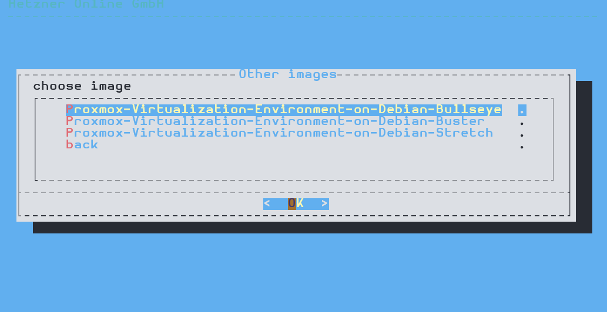
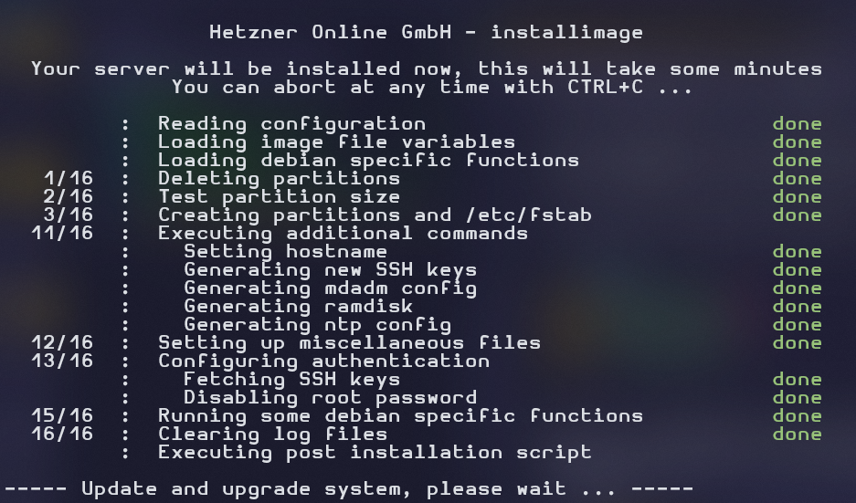
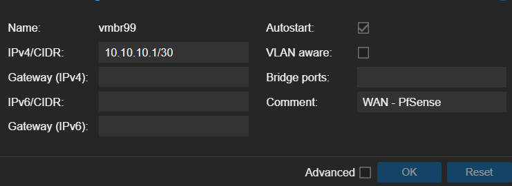
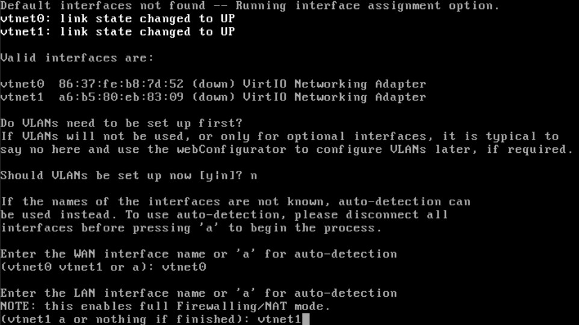

[Link](https://jmg-it.de)

## Introduction

Proxmox VE is an open-source virtualization platform with support for KVM. The possibilities of network configuration are versatile. The basics are taught [here](https://community.hetzner.com/tutorials/install-and-configure-proxmox_ve/en).
With this tutorial, you are able to configure a Proxmox server in such a way that you can manage network traffic within an [RFC1918 Private Network](https://www.rfc-editor.org/rfc/rfc1918.txt) (10.0.0.0/8, 192.168.1.0/24, etc.) of all your VMs using a router VM on the Proxmox server. We will use PfSense for this purpose, but any configuration on the VM is possible (other firewall OS, Debain + IPtables, etc.).


**Prerequisites**

We try to address the versatile configuration options here.
However, due to different hardware configurations, it may be necessary to adjust individual points of the configuration. (Mainly storage configuration Proxmox, details of the network adapter)

* How to install Proxmox is basically irrelevant for network configuration.
    * You can choose the installation image from Hetzner (as described below), but you could also install Proxmox manually as described [here](https://community.hetzner.com/tutorials/install-and-configure-proxmox_ve/en).

## Step 1 - `<Install Promox>`


First, we boot the server into the Hetzner proprietary [rescue system](https://docs.hetzner.com/en/robot/dedicated-server/troubleshooting/hetzner-rescue-system/) and connect via SSH.

With the up arrow key on your keyboard, you can query a series of handy commands that Hetzner has prepared.
At this point, I would like to explicitly praise the speed test.

## Step 2 - `<Installimage>`

We now call up [installimage](https://docs.hetzner.com/en/robot/dedicated-server/operating-systems/installimage/) with the command `installimage`.

Under the "other" section, we find a selection of available Proxmox versions.

Note: Hetzner only supports the *configuration* of the Proxmox images through the [tutorials](https://community.hetzner.com/tutorials).
Normal activities such as "helping hand," etc. are of course carried out.



We select "Debian BullsEye" here.


### Step 2.1 - `<installimage/install.conf>`

By default, a software RAID (SWRAID) is created.

In this tutorial, we will configure a SWRAID 0 and mount the entire storage as a local disk in Proxmox.
Depending on your goals, this can be useful but it doesn't have to be.

Of course, you can adjust the exact configuration to your needs in the text editor of the install.conf, or you can simply follow this guide.

All the points you need are already present in the config, you just need to scroll and adjust the values.


```shell
## activate software RAID?  <0 | 1>
SWRAID 1
```
set the SWRAIDLEVEL:
```shell
SWRAIDLEVEL 0
```
set a hostname:
```shell
HOSTNAME ax61.hetzner-local.dc
```
The hostname must always be an FQDN.

Now we scroll down until we no longer see any # signs in front of the lines.
Here we are greeted by the partitioning of the system.

A very simple variant:

```shell
PART swap swap 16G 
PART /boot ext4 2G
PART / ext4 all
```

Save and close with F2 + F10 or by clicking on the keys in the editor.
Now we confirm several messages that should be apparent from the context.




## Step 3 - `<Setting up Proxmox>`

After the reboot, we can access the Proxmox WebUI at `https://HOSTNAME:8006`, or connect via SSH.

## Step 4 - `<Setting up a Router-VM>`

As already mentioned, the possibilities here are manifold. However, for the sake of simplicity, we will use a PfSense VM. (Networkers laugh and cry at this sentence)

To set up PfSense, we need a VM *with GUI and browser*, as you probably have not yet established a VPN to the host system.

So, we need an Ubuntu & a PfSense ISO on the host system. (on the WebUI: Datacenter -> Hostname -> Local -> Iso Images)

### Step 4.1 - `<vmbr WAN>`

Before we install these images, we need so-called vm-bridges `vmbr`:
(on the WebUI: Datacenter -> Hostname -> Network)

You can choose the number of vmbr freely.
You can also choose the network ranges for the WAN interface of the router VM freely, if you know what you are doing and were to change it accodingly.
If unsure, use 10.10.10.1/30.



### Step 4.2 - `<vmbr LAN>`

In addition, we need a vmbr that acts as the LAN interface for the router VM.

This IP range corresponds to the default values of the PfSense LAN network which conveniently runs a DHCP server:

IPv4/CIDR: 192.168.1.2/24

Set this bridge up just like the WAN brigde, but with the IP range decribed above this sentence.

### Step 4.3 - `<Installing Ubuntu VM>`

Now we create a new VM with the Ubuntu ISO.
The network adapter should be connected to the vmbr LAN, but does not require any further configuration in the guest system, as PfSense sends a DHCP packet.
(on the WebUI: Datacenter -> Hostname of the Ubuntu VM -> VM -> Hardware)

### Step 4.4 - `<Installing PfSense>`

Now we create a new VM with the PfSense ISO.
In general, it is recommended to provide sufficient resources to the PfSense VM.
Before starting the VM, we assign two new network adapters as *VirtIO Interfaces* to the vmbridges created earlier.
(on the WebUI: Datacenter -> Hostname -> VM -> Hardware)

Next, we start and install the PfSense VM. The installation is self-explanatory after booting the VM.


After the reboot, we assign the created network interfaces.
The MAC addresses can be used to differentiate between the adapters if necessary.


### Step 4.5 - `<Setting up PfSense>`

Now we connect via browser from the Ubuntu VM to the IP of the router VM, which is 192.168.1.1.

Username: admin
Password: pfsense

The setup is self-explanatory until the "Configure WAN Interface" step.

Here, we select "Static" for Selected Type and enter the IP 10.10.10.2 for IP configuration.
We choose /30 as the subnet mask.

For the gateway, we enter the Public IP of the host. It is important to check the box `Use non-local gateway through interface specific route` in the "Advanced" settings of the gateway.
(System -> Routing -> Gateways -> Edit)


### Step 4.5.1 - `<Hardware checksum offload>`

Important:

Now it is essential to disable the `hardware checksum offload` as it causes issues with VirtIO interfaces. [Link to documentation](https://docs.netgate.com/pfsense/en/latest/recipes/virtualize-proxmox-ve.html#disable-hardware-checksums-with-proxmox-ve-virtio)
(System -> Advanced -> Networking -> Network Interfaces -> Disable hardware checksum offload ✅)


### Step 5 - `<Network configuration on the host system>`

This is where the magic happens.

Now we need to edit the interfaces file on the host system (Proxmox).

This configuration file defines the network interfaces of the system and the settings for each of these interfaces.

The file already exists and can be edited with `nano /etc/network/interfaces`.

Below you will find a complete interfaces file.

### Step 5.1 - `<Editing the config>`

Ideally, you should copy both the file from the system and the example configuration to your local machiene, and transfer the details of your file to the one shown below. This step is absolutely necessary because INTERFACENAME in our file must be replaced with the name of your network interface if you want to continue accessing your Proxmox Host.

Variables to be edited:
        *IP-HOSTSYSTEM
        *GATEWAY-HOSTSYSTEM
        *INTERFACENAME
        *The names of the `vmbr` you created may differ from the `vmbr1` and `vmbr99` defined below.

### Step 5.2 - `<Interfaces>`

You can take over the IPv6 configuration (iface INTERFACENAME inet6 static) from the file automatically generated by the host.


INTERFACENAME: This is the interface used for WAN traffic (Internet). It is configured with a static IP address and forwards all traffic that is not intended for port 22 or 8006 to the PfSense VM with IP address 10.10.10.2.

vmbr1: This is the bridge for the local network (LAN). It is configured with a static IP address.


vmbr99: This is the bridge for the WAN network between the host and the PfSense VM. It is also configured with a static IP address.

### Step 5.3 - `<NAT Rules>`


The first "iptables" rule on the Public Interface says that any incoming TCP traffic that is not destined for ports 8006 or 22 should be forwarded to an internal IP address of 10.10.10.2. The exclamation mark (!) before "--dport" means "not", so any port other than 8006 and 22 will match this rule.

The second "iptables" rule says that any incoming UDP traffic should be forwarded to the same internal IP address of 10.10.10.2. Since there is no port restriction, this rule will match any incoming UDP traffic.

By forwarding incoming traffic to an internal IP address, NAT allows devices on the internal network to communicate with the outside world using the public IP address of the network interface that is specified in the "gateway" parameter. 


```shell
#network interface settings; JMG-IT 2023
#Please do NOT modify this file directly, unless you really know what
#you're doing.

source /etc/network/interfaces.d/*

auto lo
iface lo inet loopback

iface lo inet6 loopback

auto INTERFACENAME
iface INTERFACENAME inet static
        address IP-HOSTSYSTEM/32
        gateway GATEWAY-HOSTSYSTEM
        post-up echo 1 > /proc/sys/net/ipv4/ip_forward
        post-up sysctl -w net.ipv6.conf.all.forwarding=0
        post-up iptables -t nat -A PREROUTING -i INTERFACENAME -p tcp -m multiport ! --dport 8006,22 -j DNAT --to 10.10.10.2
        post-up iptables -t nat -A PREROUTING -i INTERFACENAME -p udp -j DNAT --to 10.10.10.2
#WAN - All ports that are NOT 22,8006[SSH,PVE] DNAT to PfSense VM on 10.10.10.2

iface INTERFACENAME inet6 static
        address 2a01:xxxx::xxxx::x/64
        gateway fe80::1

auto vmbr99
iface vmbr99 inet static
        address 10.10.10.1/30
        bridge-ports none
        bridge-stp off
        bridge-fd 0
        post-up   iptables -t nat -A POSTROUTING -s '10.10.10.0/30' -o INTERFACENAME -j MASQUERADE
        post-down iptables -t nat -D POSTROUTING -s '10.10.10.0/30' -o INTERFACENAME -j MASQUERADE
        post-up   iptables -t raw -I PREROUTING -i fwbr+ -j CT --zone 1
        post-down iptables -t raw -D PREROUTING -i fwbr+ -j CT --zone 1
#WANBRIDGE

auto vmbr1
iface vmbr1 inet static
        address 192.168.1.2/24
        bridge-ports none
        bridge-stp off
        bridge-fd 0
#LAN Bridge
```
## Conclusion

Now you should have a LAN network that is being NATed to the Internet. All ports except 8006 and 22 are now forwarded from the Proxmox host to the PfSense VM.


##### License: MIT

<!--

Contributor's Certificate of Origin

By making a contribution to this project, I certify that:

(a) The contribution was created in whole or in part by me and I have
    the right to submit it under the license indicated in the file; or

(b) The contribution is based upon previous work that, to the best of my
    knowledge, is covered under an appropriate license and I have the
    right under that license to submit that work with modifications,
    whether created in whole or in part by me, under the same license
    (unless I am permitted to submit under a different license), as
    indicated in the file; or

(c) The contribution was provided directly to me by some other person
    who certified (a), (b) or (c) and I have not modified it.

(d) I understand and agree that this project and the contribution are
    public and that a record of the contribution (including all personal
    information I submit with it, including my sign-off) is maintained
    indefinitely and may be redistributed consistent with this project
    or the license(s) involved.

Signed-off-by: Jakob Langisch, J.Langisch@jmg-it.de

-->
